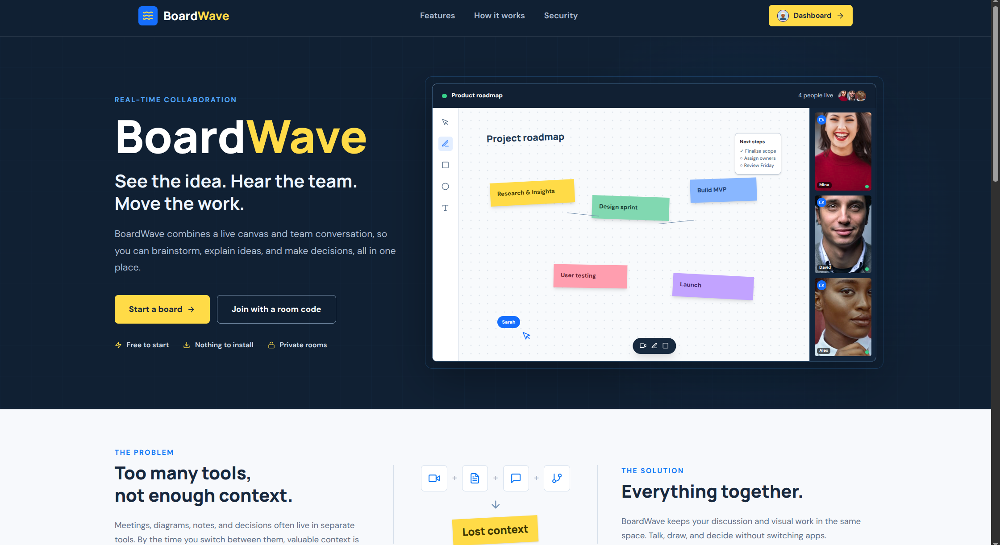
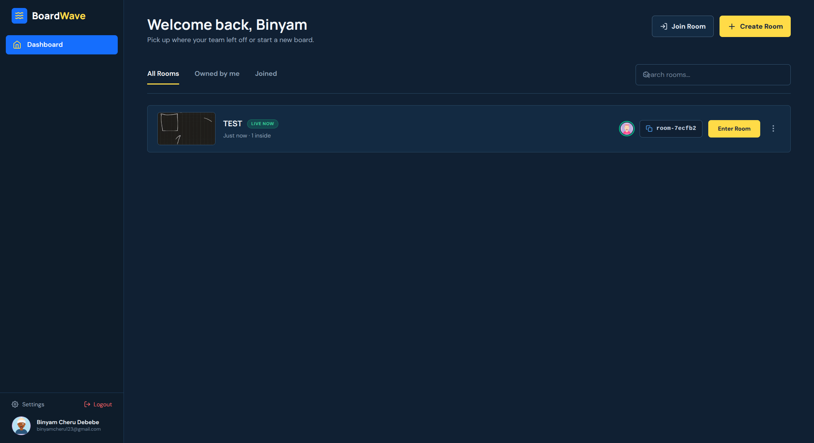
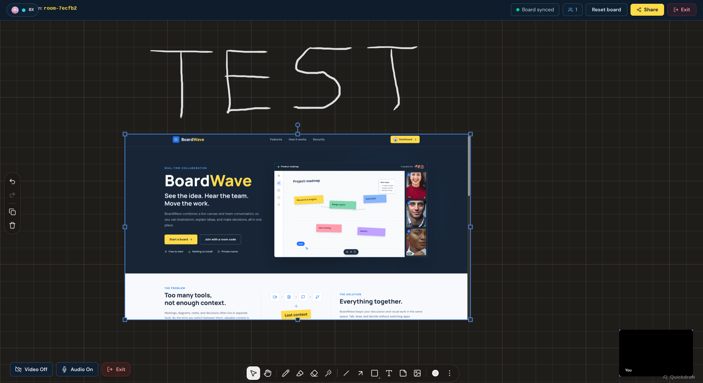
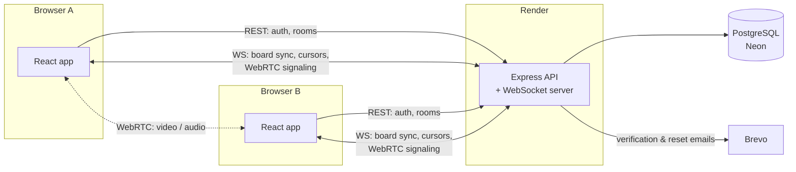

<div align="center">

# BoardWave

**See the idea. Hear the team. Move the work.**

A real-time collaborative whiteboard with built-in video calls. Draw on a shared canvas with live cursors while talking to your team over peer-to-peer video — all in the browser, nothing to install.

[**Live app**](https://boardwave.vercel.app) · [API](https://boardwave-ibbj.onrender.com) · [Report a bug](https://github.com/binyamcheru/boardwave/issues)



</div>

> The API runs on Render's free tier and sleeps after 15 minutes of inactivity. The first request after a quiet period can take 30–60 seconds while it wakes up.

---

## Table of contents

- [Features](#features)
- [Screenshots](#screenshots)
- [How it works](#how-it-works)
- [Tech stack](#tech-stack)
- [Project structure](#project-structure)
- [Getting started](#getting-started)
- [Environment variables](#environment-variables)
- [API overview](#api-overview)
- [Deployment](#deployment)
- [Known limitations](#known-limitations)

## Features

**Collaboration**
- Shared drawing canvas — pen, shapes, arrows, text, sticky notes and images — synced to every participant in real time
- Live cursors with each collaborator's name and avatar
- Peer-to-peer video and audio via a WebRTC mesh, with camera/mic toggles and a graceful fallback when no device is available
- Board state is persisted automatically, so a room can be reopened later exactly where it was left

**Rooms**
- Create a room and share its short code (e.g. `room-7ecfb2`); others join by code or link
- Host / participant roles, lockable rooms, and a per-room peer limit
- Dashboard with search, *All / Owned by me / Joined* filters, board thumbnails, last-activity time and a **Live now** badge showing who is currently inside
- Rename or delete boards you own

**Accounts**
- Registration with an avatar picker (DiceBear Avataaars), email verification, login, forgot/reset password and profile editing
- JSON Web Tokens for the REST API and WebSocket handshake; passwords hashed with bcrypt
- Transactional email through Brevo's HTTP API

## Screenshots

| Dashboard | Live room |
|---|---|
|  |  |

## How it works



1. A user signs in and opens a room. The browser opens a WebSocket to the API, authenticating with its JWT, and sends `JOIN_ROOM`.
2. The server checks membership and capacity, replies with the latest `BOARD_SNAPSHOT` and the list of `EXISTING_PEERS`, and tells everyone else a `USER_JOINED`.
3. Peers exchange WebRTC offers, answers and ICE candidates through the socket, then stream video and audio **directly to each other** — media never touches the server.
4. Canvas edits are broadcast as `BOARD_SYNC` messages. The server keeps the latest snapshot in memory, debounces writes to PostgreSQL, and flushes when the last peer leaves.
5. Shortly after each change the room captures a small JPEG of the board and uploads it, which is what the dashboard shows as the thumbnail.
6. If the socket drops, the client reconnects with exponential backoff and re-joins the room.

## Tech stack

| Layer | Technology |
|---|---|
| Frontend | React 19, TypeScript, Vite, Tailwind CSS 4, React Router 7, Framer Motion, [Quickdraw](https://www.npmjs.com/package/@quickdrawjs/react) canvas |
| Backend | Node.js, Express 5, TypeScript, [`ws`](https://github.com/websockets/ws), JSON Web Tokens, bcrypt |
| Database | PostgreSQL on [Neon](https://neon.tech), Prisma 7 with the `pg` driver adapter |
| Real-time | WebSockets for signaling and board sync, WebRTC (STUN/TURN) for media |
| Email | [Brevo](https://www.brevo.com) transactional API |
| Hosting | Vercel (frontend), Render (API) |

## Project structure

```
boardwave/
├── backend/
│   ├── prisma/
│   │   ├── schema.prisma          # User, Room, Board, RoomMember, CanvasSnapshot, VerificationToken
│   │   └── migrations/
│   └── src/
│       ├── index.ts               # Express app, CORS, HTTP server, /api/ice-config
│       ├── wsHandler.ts           # WebSocket rooms, signaling relay, board persistence
│       ├── db.ts                  # Prisma client with pg adapter
│       ├── routes/
│       │   ├── auth.route.ts      # register, verify, login, profile, password reset
│       │   └── rooms.routes.ts    # list, create, join, rename, delete, thumbnail
│       ├── middleware/auth.middleware.ts
│       └── lib/                   # jwt, mail (Brevo), clientUrl
└── frontend/
    └── src/
        ├── App.tsx                # routes + ProtectedRoute
        ├── context/AuthContext.tsx
        ├── auth/                  # Login, Register, VerifyEmail, ForgotPassword, ResetPassword
        ├── dashboard/             # Dashboard, RoomCard, modals, Sidebar, Header, filters
        ├── room/                  # RoomPage, canvas wrapper
        ├── hooks/useWebRTC.ts     # socket + peer connections + local media
        ├── homepage/              # landing page sections
        ├── components/            # Toast, ConfirmDialog, UserAvatar, BrandMark
        └── lib/                   # avataaars helpers, board thumbnail capture
```

## Getting started

### Prerequisites

- Node.js 22 or newer
- A PostgreSQL database (a free [Neon](https://neon.tech) project works well)
- Optional: a [Brevo](https://www.brevo.com) account for sending real emails. Without one, verification and reset links are printed to the server console.

### 1. Clone

```bash
git clone https://github.com/binyamcheru/boardwave.git
cd boardwave
```

### 2. Backend

```bash
cd backend
npm install
cp .env.example .env        # then fill in DATABASE_URL and JWT_SECRET
npx prisma migrate deploy   # create the tables
npm run dev                 # http://localhost:3000
```

### 3. Frontend

```bash
cd ../frontend
npm install
cp .env.example .env        # defaults point at http://localhost:3000
npm run dev                 # http://localhost:5173
```

Open two browser windows, register two accounts (grab the verification links from the backend console if email isn't configured), create a room in one and join it by code in the other.

## Environment variables

### `backend/.env`

| Variable | Required | Description |
|---|---|---|
| `PORT` | no | HTTP port, defaults to `3000` (Render sets this automatically) |
| `DATABASE_URL` | **yes** | PostgreSQL connection string. `sslmode` is upgraded to `verify-full` for hosted databases |
| `JWT_SECRET` | **yes** | Secret for signing access tokens — `openssl rand -hex 32` |
| `CLIENT_URL` | no | Frontend origin used in email links, e.g. `https://boardwave.vercel.app` |
| `CLIENT_URLS` | no | Comma-separated origins allowed by CORS. Localhost is always allowed outside production |
| `BREVO_API_KEY` | no | Brevo v3 API key (`xkeysib-…`). If unset, email links are logged instead of sent |
| `EMAIL_FROM` | no | Verified sender address in Brevo |
| `EMAIL_FROM_NAME` | no | Sender display name, defaults to `BoardWave` |
| `STUN_URL` | no | Defaults to Google's public STUN server |
| `TURN_URL` / `TURN_USERNAME` / `TURN_CREDENTIAL` | no | TURN relay for peers behind strict NATs |
| `LOG_EMAIL_LINKS` | no | `true` to log verification/reset links in production when delivery fails |
| `NODE_ENV` | no | Set to `production` in deployment to enforce the CORS allowlist |

### `frontend/.env`

| Variable | Description |
|---|---|
| `VITE_API_URL` | Base URL of the API, e.g. `https://boardwave-ibbj.onrender.com` |
| `VITE_WS_URL` | WebSocket URL of the API, e.g. `wss://boardwave-ibbj.onrender.com` |

## API overview

All routes are prefixed with `/api`. Protected routes expect `Authorization: Bearer <token>`.

### Auth

| Method | Route | Description |
|---|---|---|
| `POST` | `/auth/register` | Create an account and send a verification email |
| `POST` | `/auth/setup-avatar` | Save the avatar chosen during sign-up |
| `POST` | `/auth/verify-email` | Confirm the email with the token from the link |
| `POST` | `/auth/resend-verification` | Request a fresh verification link |
| `POST` | `/auth/login` | Exchange credentials for a 7-day JWT |
| `GET` | `/auth/me` | Current user profile (protected) |
| `PATCH` | `/auth/me` | Update name and avatar (protected) |
| `POST` | `/auth/forgot-password` | Send a 1-hour reset link |
| `POST` | `/auth/reset-password` | Set a new password with the reset token |

### Rooms

| Method | Route | Description |
|---|---|---|
| `GET` | `/rooms?filter=owned\|joined&search=` | Rooms the user owns or has joined, with thumbnails and live presence |
| `POST` | `/rooms` | Create a room (caller becomes `HOST`) |
| `POST` | `/rooms/join` | Join a room by code |
| `PATCH` | `/rooms/:id` | Rename a room (owner only) |
| `DELETE` | `/rooms/:id` | Delete a room (owner only) |
| `PATCH` | `/rooms/:id/thumbnail` | Upload a board preview (members only) |
| `GET` | `/ice-config` | STUN/TURN servers for the WebRTC client |

### WebSocket messages

Connect to `wss://<api>/?token=<jwt>` and send JSON objects with a `type` field.

| Direction | Type | Purpose |
|---|---|---|
| client → server | `JOIN_ROOM` | Enter a room; server validates membership and capacity |
| client → server | `BOARD_SYNC` | Broadcast a canvas diff and/or full snapshot |
| client → server | `CURSOR_MOVE` | Broadcast pointer position and active tool |
| client → server | `SIGNAL_OFFER` / `SIGNAL_ANSWER` / `ICE_CANDIDATE` | Relayed to `targetId` for WebRTC negotiation |
| client → server | `PING` | Keep-alive, answered with `PONG` |
| server → client | `BOARD_SNAPSHOT` | Latest saved canvas, sent on join |
| server → client | `EXISTING_PEERS` | Peers already in the room, with names and avatars |
| server → client | `USER_JOINED` / `USER_LEFT` | Presence changes |
| server → client | `ERROR` | `UNAUTHORIZED`, `FORBIDDEN`, `NOT_FOUND`, `ROOM_FULL`, `BAD_REQUEST` |

## Deployment

The app is split across three free-tier services:

**Neon** — create a project and copy the pooled connection string into `DATABASE_URL`.

**Render** (API) — new *Web Service* from this repo:

| Setting | Value |
|---|---|
| Root directory | `backend` |
| Build command | `npm install --include=dev && npx prisma migrate deploy && npm run build` |
| Start command | `npm start` |
| Environment | the variables listed above, with `NODE_ENV=production` and `CLIENT_URLS` set to the Vercel URL |

Render supports WebSockets out of the box, so the same URL serves both `https://` and `wss://`.

**Vercel** (frontend) — import the repo with root directory `frontend`. [`vercel.json`](frontend/vercel.json) already rewrites all paths to `index.html` for client-side routing. Set `VITE_API_URL` and `VITE_WS_URL` to the Render URL and redeploy — Vite bakes these in at build time.

## Known limitations

- **Mesh topology.** Every participant sends their video to every other participant, so rooms are capped at 4 peers. Larger calls would need an SFU.
- **Single instance.** Room membership and the latest board snapshot live in the API's memory. Running more than one instance would require sticky sessions or a shared store such as Redis.
- **Cold starts.** Render's free tier spins the API down when idle, which also drops open WebSocket connections. The client reconnects, but the first load can be slow.
- **NAT traversal.** Only a STUN server is configured by default. Peers behind symmetric NATs or strict corporate firewalls need a TURN relay (`TURN_URL`).
- **Snapshots / version history** are modelled in the schema (`CanvasSnapshot`) but not yet exposed in the UI.

## Author

**Binyam Cheru Debebe** — [github.com/binyamcheru](https://github.com/binyamcheru)
